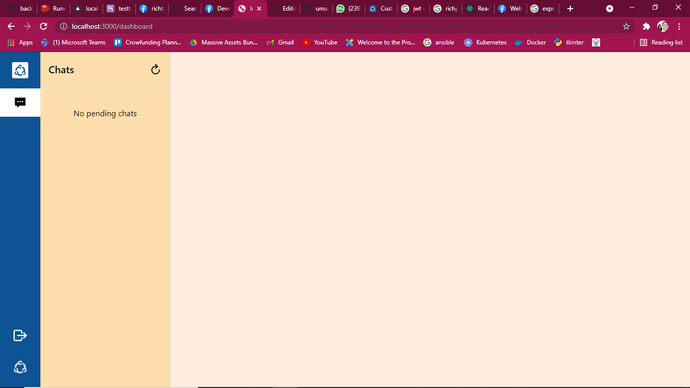
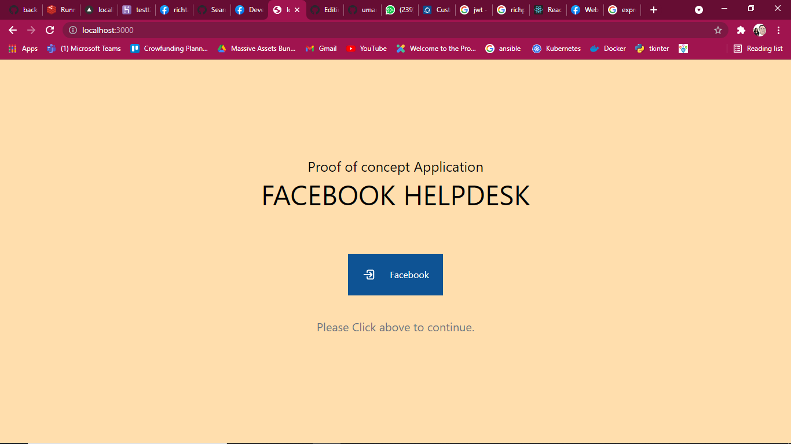

  <!-- Dependency Status -->
<h3> Frontend Deployment Link :https://ricfront.vercel.app/</h3>
<h3> Backend Deployment Link : https://testt222222.herokuapp.com/</h3>

This app will allow clients to connect their fb accounts, listen to their comments or messenger messages and reply to them within the application.

<h1 align="center">
  
</h1>

## Key Features

* Login using Facebook login id and password
* Real time chat update with auto refreshing
* Time stamp to segeregate the messages

## Technologies and Third party libraries

A few things to note in the project:
* **[Node.js]()** - Node.js® is a JavaScript runtime built on Chrome's V8 JavaScript engine. 
* **[React JS]()** - A JavaScript library for building user interfaces.
* Docker - Docker script to start service in production mode.
* **[Express]()** - Express.js, or simply Express, is a back end web application framework for Node.js, released as free and open-source software under the MIT License.
* **[Mongo Database](#)** - MongoDB is a source-available cross-platform document-oriented database program. Classified as a NoSQL database program, MongoDB uses JSON-like documents with optional schemas. 
* **[Webhooks]()** - Webhooks allows you to receive real-time HTTP notifications of changes to specific objects in the Facebook Social Graph.

## Customer App

  
  
  

## Reference

Refer these documents for development
○	https://developers.facebook.com/docs/messenger-platform/
○	https://developers.facebook.com/docs/pages/
○	https://developers.facebook.com/docs/facebook-login/ 

## Question?

I did my best to complete this work in after work hours. There is a lot of room for improvement.

## Stones left unturned

* **[webhook]()** - linking of the callback from facebook developer page to deployed server because of that chatting is not functional though the code is complete and only bugs are needed to be fixed. 
* **[comments fetching]()** - I couldn't touch the comments part because of lack of time.
* Docker - Docker script to start service in production mode.
* **[sending message]()** - Coding and integration is done as well as the UI. Only webhook callback is stopping this.
* **[Chat](#)** - UI and coding done but not compatible on development mode as of now. 
* **[Responsiveness]()** - ] It's not using media queries as of now.
